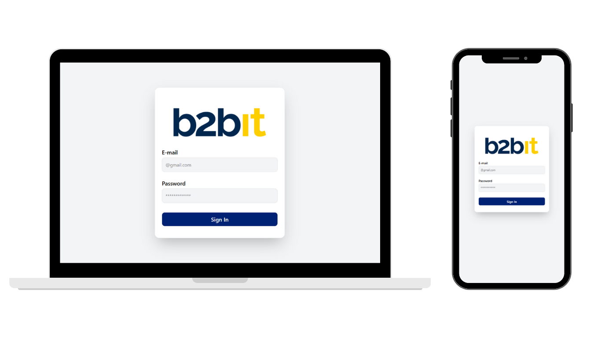

# 🚀 Processo seletivo B2bit Company

[](https://reactjs.org/)
[](https://vitejs.dev/)
[](https://tailwindcss.com/)
[](https://formik.org/)
[](https://axios-http.com/)
[](https://reactrouter.com/)
[](https://www.cypress.io/)
[](https://ui.shadcn.com/)

---

## 💡 Descrição

Aplicação web construída com **React + Vite** que permite:

* Login com autenticação via API.
* Persistência da sessão do usuário (LocalStorage).
* Exibição do perfil do usuário em página protegida.
* Logout com remoção de credenciais.
* Feedback de erros em login inválido.
* Componentes estilizados usando **shadcn/ui** para consistência visual.

---

## 🛠 Tecnologias

* **React**: Interface moderna e reativa.
* **Vite**: Build rápida e otimizada.
* **TailwindCSS**: Estilização rápida e responsiva.
* **shadcn/ui**: Componentes UI prontos e consistentes.
* **React Router**: Navegação e rotas protegidas.
* **Formik**: Validação e gerenciamento de formulários.
* **Axios + Interceptor**: Requisições HTTP com tratamento global de tokens e erros.
* **Cypress (E2E)**: Testes end-to-end de fluxos críticos (login, perfil, logout).

---

## 🔑 Funcionalidades

1. **Login**: autenticação via API e validação de formulário.
2. **Persistência de sessão**: usuário permanece logado via LocalStorage.
3. **Feedback de erro**: exibição de mensagem quando credenciais estão incorretas.
4. **Página de Perfil**: informações do usuário exibidas apenas para usuários autenticados.
5. **Logout**: remoção de token e redirecionamento para login.

---

## 📸 Screenshots / Mockups

### Página de Login



### Página de Perfil


---

## ⚡ Como Rodar

```bash
# Clonar o repositório
git clone https://github.com/879372/b2bit-company.git

# Instalar dependências
npm install

# Rodar aplicação
npm run dev

# Abrir Cypress para testes E2E
npx cypress open
```

---

## 📌 Considerações

Este projeto demonstra:

* Fluxo completo de autenticação com React + Vite.
* Boas práticas em formulários e feedback de erros com **Formik**.
* Navegação segura com **React Router**.
* Consumo de API com **Axios** e interceptores.
* Componentes consistentes com **shadcn/ui**.
* Estilização rápida e moderna com **TailwindCSS**.
* Testes automatizados com **Cypress** para garantir qualidade do fluxo.
